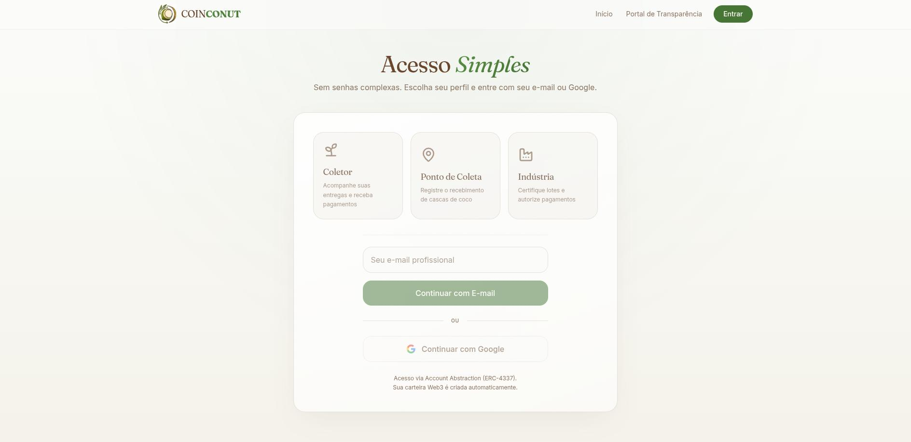
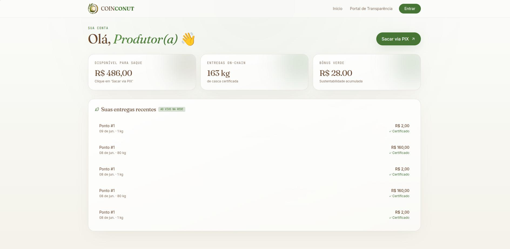
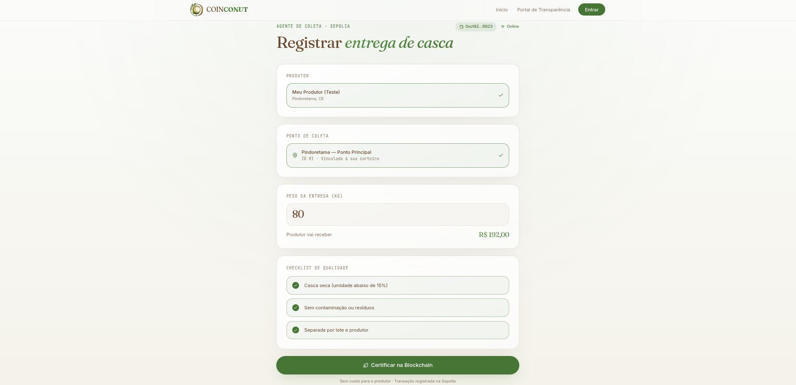
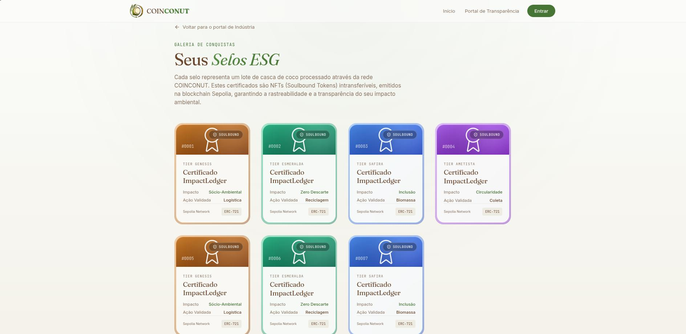
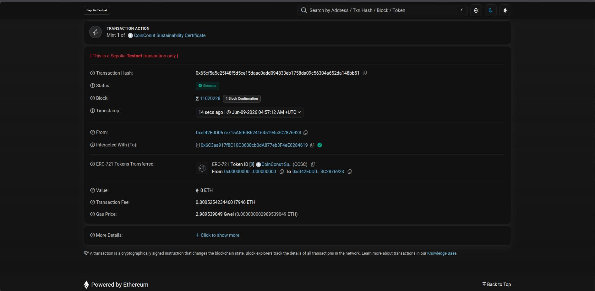

# COINCONUT — ImpactLedger
  

## Sobre o desafio
Projeto oficial submetido ao desafio **ImpactLedger** do Hackathon Web3 RESTIC 29.

## Objetivo
Construir uma solução baseada em blockchain capaz de registrar, validar e certificar ações de impacto social e ambiental. A **COINCONUT** alcança isso certificando toda a logística reversa e a reciclagem da casca do coco.

## O Problema e a Solução

### Problemática
O descarte irregular da casca do coco, no qual representa **85% do peso total do fruto**, acarreta graves problemas ambientais e logísticos. Essa cadeia sofre hoje com três grandes gargalos:

- **Iniciativa Pública Ineficiente:** A coleta seletiva municipal frequentemente falha ou inexiste, deixando a responsabilidade nos ombros de catadores locais.
- **Vulnerabilidade Social:** Esses trabalhadores atuam de forma invisível, sofrendo com a falta de transparência e atrasos crônicos nos pagamentos.
- **Greenwashing Industrial:** As indústrias enfrentam sérias dificuldades para rastrear e comprovar suas práticas ESG de ponta a ponta de maneira verdadeiramente auditável.

### Solução
Desenvolvemos uma **infraestrutura Web3 descentralizada** que transforma o resíduo em impacto social e ambiental mensurável, estruturada em três pilares:

- **Rastreabilidade On-Chain:** A pesagem da casca do coco gera um registro imutável e auditável diretamente na blockchain.
- **Selo ESG em NFT (Soulbound):** Quando a indústria adquire a matéria-prima para transformação, os Smart Contracts emitem um token intransferível (Soulbound) que atesta a prática ecológica real da empresa.
- **Pagamento Instantâneo via Pix:** Utilizando a tecnologia de Oráculos, o sistema liquida o pagamento do catador de forma automatizada e imediata assim que a pesagem é validada, eliminando intermediários e atrasos.

## Links e Demonstração

**Link da aplicação:** [https://coinconut-hackathon.vercel.app](https://coinconut-hackathon.vercel.app)

**Demonstração funcional:** 
O fluxo principal é orquestrado através de 3 portais:
1. **Posto de Coleta:** Pesa a casca e assina a transação, emitindo o registro imutável do lote e transferindo a custódia.
2. **Indústria:** Adquire a matéria-prima rastreada no painel e a converte em produtos ecológicos (Briquete, Fibra).
3. **Catador:** Acessa seu Dashboard para ver suas entregas validadas e sacar a sua remuneração de forma instantânea via simulador de Oráculo PIX.

**Demonstração auditável:** 
- A cada pesagem, um lote tokenizado (`ERC-1155`) é gerado no contrato `CocoAsset`.
- A cada transformação feita pela Indústria, o contrato emite um certificado intransferível (`ERC-721`) que fica guardado permanentemente na Galeria ESG.
- **Vídeo Demo / Pitch:** *(Inserir Link do YouTube aqui)*

**Smart Contracts Deployados (Sepolia Testnet):**
- **CocoAsset (Lotes ERC-1155):** [0x961379292204ED01DC6436dC2db666f5E9532bCb](https://sepolia.etherscan.io/address/0x961379292204ED01DC6436dC2db666f5E9532bCb)
- **CoconutRegistry (Logística):** [0xF6f39040a3dA724E466Eb31f9Da0EBc8Fc552E70](https://sepolia.etherscan.io/address/0xF6f39040a3dA724E466Eb31f9Da0EBc8Fc552E70)
- **PaymentLedger (Oráculo PIX):** [0x80d9A97CEE8F8530888879d09fc1010082aFEd64](https://sepolia.etherscan.io/address/0x80d9A97CEE8F8530888879d09fc1010082aFEd64)
- **BriquetteMarket (B2B):** [0xFFd48Fd40f6C3c734a384d1f7FB2581185AaDA8e](https://sepolia.etherscan.io/address/0xFFd48Fd40f6C3c734a384d1f7FB2581185AaDA8e)
- **SustainabilityNFT (Selo ESG ERC-721):** [0x6C3aa917f8C10C3608cb0dA877eb3F4eE6284619](https://sepolia.etherscan.io/address/0x6C3aa917f8C10C3608cb0dA877eb3F4eE6284619)

---

## Demonstração Visual (Screenshots)

> **Nota:** As imagens abaixo ilustram o fluxo simplificado e intuitivo do COINCONUT.

### 1. Acesso Simples via Web2 (Account Abstraction)

<br/>
Sem carteiras complexas. Catadores e Pontos de coleta acessam diretamente com e-mail/Google.

### 2. Dashboard do Catador (Oráculo PIX)

<br/>
Acompanhamento em tempo real das pesagens validadas e saldo disponível para saque imediato.

### 3. Registro do Ponto de Coleta (Rastreabilidade)

<br/>
A pesagem física da casca de coco é inserida no sistema e cunhada como um lote ERC-1155 imutável.

### 4. Galeria ESG (NFTs Soulbound)

<br/>
Os certificados de logística reversa são transformados em Trading Cards colecionáveis e intransferíveis para as fábricas.

### 5. Prova de Auditoria On-Chain (Transparência)

<br/>
Transações verificáveis no Etherscan (Sepolia), garantindo que todo o processo seja 100% à prova de Greenwashing.

---

## Exemplos de aplicação no projeto
- Certificação de impacto ESG para fábricas.
- Registro de rastreabilidade de impacto e reciclagem (Logística Reversa).
- Remuneração justa e instantânea para pequenos produtores (Web3 + Fiat).
- Dashboard de Transparência auditável pelo governo ou ONGs.

## Tecnologias utilizadas
- **Smart Contracts:** Solidity, Hardhat, OpenZeppelin.
- **Rede:** Sepolia Testnet.
- **Frontend Web3:** Ethers.js, React 19, TypeScript, Vite.
- **Design:** Tailwind CSS v4, Framer Motion, TanStack Router.

## Estrutura do Repositório
- `/contracts`: Código-fonte dos Smart Contracts (CocoAsset, Registry, NFT, etc.)
- `/frontend`: Aplicação Web SPA e componentes de interface
- `/scripts`: Scripts automáticos de deploy e setup de permissões de rede
- `/test`: Bateria de testes de unidade (Chai/Mocha)

## Como executar

### Instalar dependências
```bash
# Na raiz, instale as dependências Hardhat
npm install

# Acesse a pasta do frontend e instale as dependências Web
cd frontend
npm install
```

### Compilar contratos
```bash
npx hardhat compile
```

### Deploy (Opcional - Já implantado)
```bash
npx hardhat run scripts/deploy.js --network sepolia
npx hardhat run scripts/setup.js --network sepolia
```

### Executar a Aplicação Web
```bash
cd frontend
npm run dev
```

## Requisitos mínimos
- **Uso de blockchain:** Sim (Todas as etapas são registradas na Sepolia).
- **Registro auditável:** Sim (Saldos, lotes e certificados NFTs são públicos no Etherscan).
- **Smart contract funcional:** Sim (Suíte de 6 contratos interligados).
- **Histórico verificável:** Sim (Página `/transparencia` sem banco de dados backend).
- **README funcional:** Sim.
- **Vídeo-pitch:** Pendente de inclusão do link.

## Declaração de Uso de Inteligência Artificial (IA)

Em conformidade com as diretrizes do Hackweb, declaramos que ferramentas de IA generativa foram utilizadas estritamente em papel de apoio ao desenvolvimento do projeto, mantendo a autoria intelectual e supervisão técnica totalmente centralizadas na equipe.

### Ferramentas Utilizadas
- **Modelos:** Google Gemini, OpenAI ChatGPT, Anthropic Claude.

### Escopo de Aplicação
1. **Concepção:** Brainstorm inicial de ideias, validação de regras de negócio e refinamento da proposta de valor do ImpactLedger.
2. **Qualidade e Segurança do Código:** Auxílio na correção de vulnerabilidades e refatoração dos Smart Contracts após as auditorias estáticas locais utilizando as ferramentas **Slither** e **Mythril**.
3. **Documentação:** Apoio na estruturação lógica, revisão ortográfica e formatação deste arquivo README.
4. **Apresentação Visual:** Geração e refinamento de imagens de apoio utilizadas nos slides e artefatos visuais do pitch.

*> **OBS:** Toda a arquitetura do ecossistema de contratos inteligentes, integrações Web3 e lógica de liquidação financeira foi desenvolvida, revisada e é perfeitamente compreendida e explicável pelos integrantes do time.*

## Equipe

| Membro | Foco |
|---|---|
| <br/>**[Josias](https://github.com/josiasdev)** | Frontend · UX · Integração |
| <br/>**[Davi](https://github.com/davicorreia-dev)** | Smart Contracts · Solidity · Deploy |
| <br/>**[Jade](https://github.com/JadeProg)** | Pitch |
| <br/>**[Willian](https://github.com/willian-uiu)** | Pitch |
