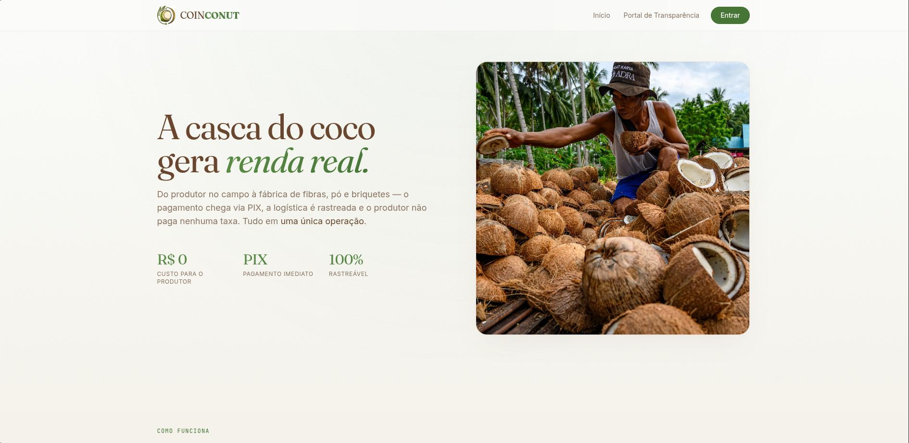

[Read in English](README.md)

# COINCONUT — ImpactLedger no Stellar


## Sobre o projeto
Projeto oficial submetido ao **PULSO Hackathon** da rede Stellar. A **COINCONUT** foi totalmente migrada e arquitetada nativamente para rodar na Blockchain Stellar, utilizando **Soroban** para os Smart Contracts e as funcionalidades nativas da rede para facilitar a adoção.

## Objetivo
Construir uma solução baseada em blockchain capaz de registrar, validar e certificar ações de impacto social e ambiental. A **COINCONUT** alcança isso certificando toda a logística reversa e a reciclagem da casca do coco, que no estado do Ceará e em grande parte do nordeste representa um grande passivo ambiental.

## O Problema e a Solução

### Problemática
O descarte irregular da casca do coco, que representa **80% do peso total do fruto**, acarreta graves problemas ambientais e logísticos. Essa cadeia sofre hoje com três grandes gargalos:
- **Iniciativa Pública Ineficiente:** A coleta seletiva municipal frequentemente falha ou inexiste, deixando a responsabilidade nos ombros de pequenos catadores locais (frequentemente desorganizados).
- **Vulnerabilidade Social:** Esses trabalhadores atuam de forma invisível, sofrendo com a falta de transparência e atrasos crônicos nos pagamentos por parte de intermediários.
- **Greenwashing Industrial:** As indústrias de sustentabilidade enfrentam sérias dificuldades para rastrear e comprovar suas práticas ESG de ponta a ponta de maneira verdadeiramente auditável.

### Solução (Powered by Stellar)
Desenvolvemos uma **infraestrutura Web3 descentralizada** na Stellar que transforma o resíduo em impacto social e ambiental mensurável, estruturada em três pilares:
- **Rastreabilidade On-Chain (Soroban):** A pesagem da casca do coco gera um registro imutável e auditável diretamente no nosso Smart Contract Soroban em Rust (`CoinconutContract`).
- **Selo ESG:** Quando a indústria processa a matéria-prima adquirida, o Smart Contract Soroban emite um Certificado de Sustentabilidade imutável que atesta a prática ecológica real da empresa, servindo como prova de ESG antifraude.
- **Liquidação Fiat Instantânea (Stellar Anchors / Fee Bumps):** Para o produtor não lidar com taxas de rede complexas, a indústria utiliza **Fee Bumps** para cobrir o custo da transação (via Freighter). A liquidação do pagamento final (off-ramp) se dá de forma automatizada (PIX) via Âncoras da Stellar.

## Links e Demonstração

**Link da aplicação:** [coinconut-b6qp.vercel.app](https://coinconut-b6qp.vercel.app)

**Vídeo Pitch:** [Assista ao nosso Demo (Loom)](https://www.loom.com/share/5119680e19fb4e7199c4891e65c51f3f)

**Demonstração funcional:** 
O fluxo principal é orquestrado através de 3 portais no frontend:
1. **Ponto de Coleta:** Pesa a casca, assina a transação e interage com o contrato na Testnet para registrar o Lote.
2. **Indústria:** Adquire o lote rastreado no painel e aciona as funções de avançar estágio e emissão de ESG (Certificado On-Chain) no Soroban.
3. **Catador (Produtor):** Acessa seu Dashboard para ver suas entregas validadas na rede Stellar e realizar a conversão (off-ramp) via simulador de SEP-24 (Oráculo PIX).

**Smart Contract Soroban (Stellar Testnet):**
- **CoinconutCore (Gestão de Lotes e ESG):** `CCIJZTJJBPU3CHI3235FR7SY22F5IOYQJOV3WAYNB3OY3MQ7TOI4AA3P`
- Visualize as transações no [Stellar Expert Testnet](https://stellar.expert/explorer/testnet/contract/CCIJZTJJBPU3CHI3235FR7SY22F5IOYQJOV3WAYNB3OY3MQ7TOI4AA3P)

---

## Exemplos de aplicação
- Certificação de impacto ESG antifraude para fábricas de substrato e fibra de coco (Ex: Indústrias no Ceará).
- Registro de rastreabilidade de impacto e reciclagem (Logística Reversa).
- Remuneração justa e instantânea para pequenos produtores através do ecossistema Fiat-to-Crypto da Stellar.

## Tecnologias utilizadas
- **Smart Contracts:** Rust, Soroban SDK, Stellar CLI.
- **Rede:** Stellar Testnet.
- **Frontend Web3:** React 19, TypeScript, Vite, `@stellar/stellar-sdk`, `@stellar/freighter-api`.
- **Design:** Tailwind CSS v4, Framer Motion, TanStack Router.

## Estrutura do Repositório
- `/soroban-contracts/contracts/coinconut`: Código-fonte do Smart Contract centralizado em Rust.
- `/frontend`: Aplicação Web SPA conectada nativamente à Freighter Wallet e ao RPC Stellar.
- `/docs`: Documentações, incluindo validação de mercado (Customer Discovery em `CUSTOMER_DISCOVERY.md`).

## Como executar o projeto localmente

### 1. Backend (Smart Contract Soroban)
Certifique-se de ter Rust, Stellar CLI e o target `wasm32-unknown-unknown` instalados.
```bash
cd soroban-contracts/contracts/coinconut

# Para rodar os testes unitários do ciclo completo de ESG e rastreabilidade:
make test

# Para compilar o arquivo WASM de produção:
make build
```

### 2. Frontend Web
```bash
# Acesse a pasta do frontend e instale as dependências
cd frontend
npm install

# Rode a aplicação (Integração com Freighter wallet)
npm run dev
```

## Requisitos mínimos do PULSO Hackathon atingidos
- **Solução construída na Stellar:** Sim (Contrato Soroban `CoinconutContract`).
- **Problema real:** Sim (Lidando com os 80% do lixo do coco e falta de transparência em ESG).
- **Adequação ao Desafio:** Perfeito encaixe no Track de "ImpactLedger/Sustentabilidade".
- **Account Abstraction / Fee Bumps:** Frontend modelado conceitualmente e preparado (config.ts) para subsidiar custos da carteira do produtor rural.
- **Vídeo-pitch:** Sim (Loom link acima).

## Equipe
- **[Josias](https://github.com/josiasdev)** | Frontend · UX · Integração Web3 
- **[Davi](https://github.com/davicorreia-dev)** | Smart Contracts · Soroban/Rust · Deploy 
- **[Jade](https://github.com/JadeProg)** | Pitch & Validação de Negócio
- **[Willian](https://github.com/willian-uiu)** | Pitch & Casos de Uso ESG
